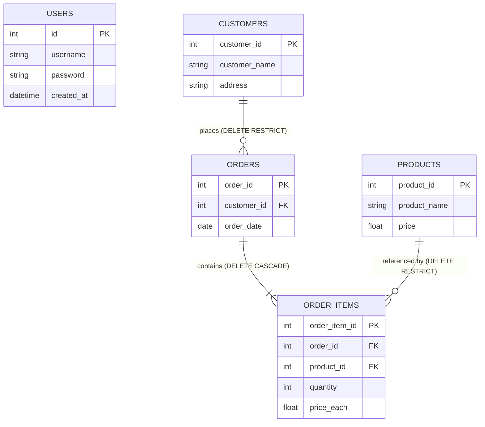
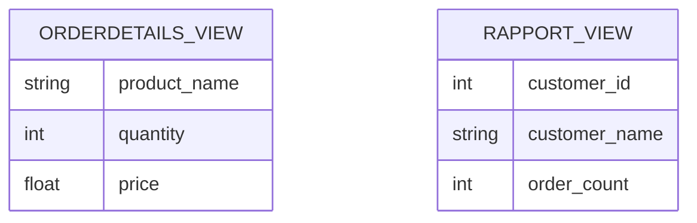
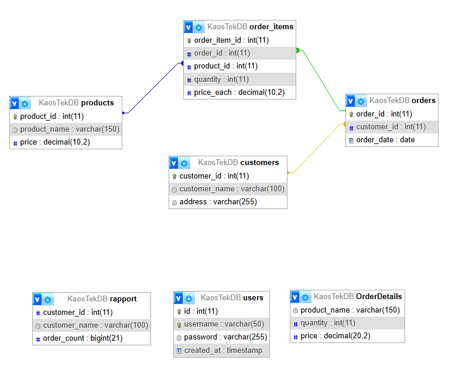

# KaosTek

KaosTek is a lightweight PHP + MySQL project that demonstrates a simple customer and orders system with user authentication. It focuses on a clean data model, straightforward server-side rendering, and a minimal, maintainable file layout.

## Highlights

- Authentication with password hashing (no plaintext passwords)
- Customers, products, orders, and order items data model
- Read-optimized database views for the dashboard (OrderDetails, rapport)
- Responsive UI built with Bootstrap 5 (CDN)

## Demo


[Watch the full demo (MP4)](assets/kaostek-demo.mp4)

## Tech stack

- PHP 8.x 
- MariaDB/MySQL
- Bootstrap 5 (via CDN) for styling/layout
- HTML5 with minimal JavaScript; jQuery Slim included where convenient

## Project structure

```
KaosTek/
-- public/                # Web-accessible entry points
 - login.php              # sign-in form and auth
 - welcome.php            # landing page; links to dashboard
 - index.php              # dashboard (requires session)
 - logout.php             # end session
 - create_user.php        # seed demo users (optional)
 - health.php             # runtime diagnostics (PHP/mysqli)
-- src/                   # PHP libraries/helpers
   - db.php               # get_db() connection helper
-- database/              # SQL schema, seed, and sample queries
   - kaostek_schema.sql
   - kaostek_seed.sql
   - create_all.sql
   - queries.sql
-- assets/                # Media used by the README (gif/mp4)
   - logo.png             # App logo
   - index.php            # Root redirect → public/welcome.php
   - db.php               # Back-compat shim → src/db.php
```

## Data model

Relational schema with referential integrity and indexes:

- users: id, username (unique), password_hash, created_at
- customers: id, name, email, phone, created_at
- products: id, name, price, created_at
- orders: id, customer_id (FK), order_date, total
- order_items: id, order_id (FK), product_id (FK), quantity, unit_price

Materialized views:

- OrderDetails: line-item detail joined with product name and price
- rapport: customer summary with total order count

See `database/kaostek_schema.sql` for the exact DDL and `database/queries.sql` for example reads.

### ER diagram



Views (derived/read-only):



### PNG diagram



## Application flow

1. User signs in on `public/login.php`
2. On success, they can access the dashboard at `public/index.php`
3. Dashboard lists:
   - Order details (from `OrderDetails` view)
   - Customers
   - Orders
   - A simple report (from `rapport` view)
4. Logout ends the session and returns to the login page

## Security notes

- Passwords are hashed with PHP’s `password_hash` and verified with `password_verify`.
- Database access is centralized in `src/db.php` to avoid duplicate credentials.
- Public files are isolated under `public/`; shared code lives in `src/`.
 
## Roadmap

- Basic CRUD pages for customers and orders
- Pagination and search on the dashboard
- CSRF protection and improved input validation
- Containerized local dev environment (docker-compose)
